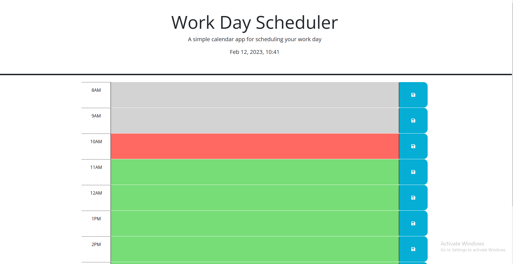

# Todo List 

## Application
This application is focused on allowing you to save a chore or task that you need to do that day, as well as giving you an opportunity to figure out what time it needs to be done. By looking at the color of the input area you are able to determine whether the time has passed, is current, or will be coming up in the future. The green indicates future, red indicates current, and grey indicates the time that has already passed. The schedule also uses JQuery to show the current time of day as well as the current date. When entering in an input you need to hit the save button located to the right of the task input. This will save the information you enter into local storage so that if you refresh the page you can see that the task is still entered and has not cleared. 

Please play with some of the tools that I have provided and if there is any constructive feedback that you can provide I would love to hear it. 
 

https://saltysourpatch.github.io/todo-list-/